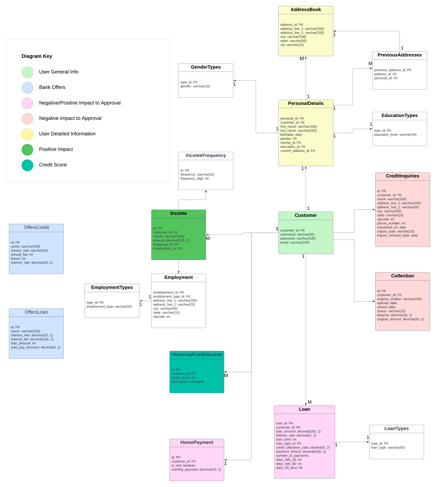

# Personal Finance - Database Structure

## Flowchart

## Setup
1. Open a command prompt or terminal window.
2. Navigate to the directory where you saved the .sql file using the cd command.
3. Execute the script using the psql command. Replace your_database_name with the name of your PostgreSQL database:

<pre>
<code>
psql -d your_database_name -f database_setup.sql
</code>
</pre>

## Preb-Built View List
1. DTI - will return `customer_id`, `total_monthly_debt`, `income`, `dti_ratio`
<pre>
<code>
SELECT * FROM DTIRatioView WHERE customer_id = 1;
</code>
</pre>

2. Credit Score Formula - will return `customer_id`, `avg_credit_score`
<pre>
<code>
SELECT * FROM AverageCreditScoresView WHERE customer_id = 1;
</code>
</pre>

2. Landing Page View - will return `customer_id`, `transunion_score`, `equifax_score`, `experian_score`, `total_debt`, `credit_usage`, `derogatory_marks`, `credit_age_months`, `hard_inquiries`, `payment_history`, `credit_card_use`, `total_accounts`
<pre>
<code>
SELECT * FROM LandingPageView WHERE customer_id = 1;
</code>
</pre>

3. Employment Info View - will return `employment_id`, `address_line_1`	`address_line_2`, `city`, `state`, `zipcode`, `name`
<pre>
<code>
SELECT * FROM EmploymentInfoView WHERE customer_id = 1;
</code>
</pre>

